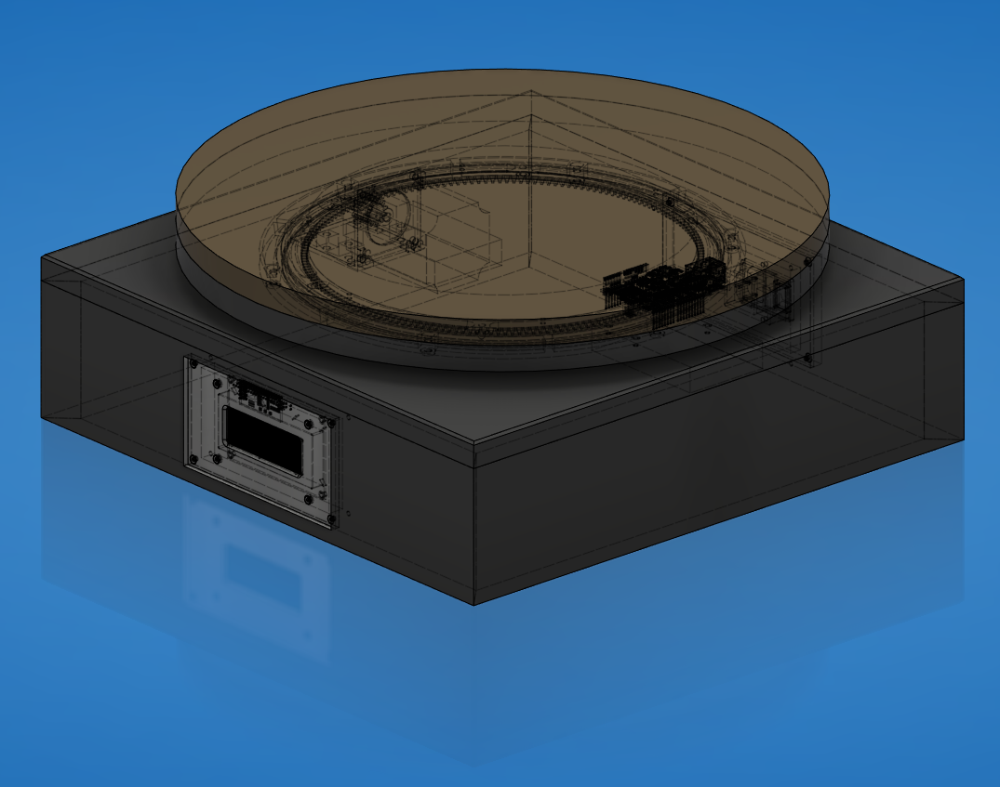
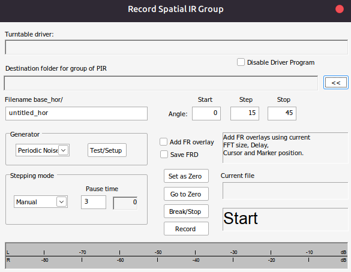

# FM-Audio ARTA Turntable

Automatischer, netzwerkfähiger Drehteller für Lautsprecher-Directivity- und Polar-Messungen mit ARTA.



## Kurzbeschreibung

Bei der Entwicklung von Lautsprechern müssen Messungen häufig unter mehreren Winkeln durchgeführt werden, z. B. 0°, 15°, 30°, 45° oder 90°. Manuell ist das langsam, fehleranfällig und schlecht reproduzierbar.

Dieses Projekt automatisiert diesen Ablauf: ARTA steuert über ein externes Turntable-Programm einen Arduino-Drehteller an. Der Arduino fährt den Lautsprecher per Schrittmotor auf den gewünschten Winkel und zeigt IP-Adresse, Referenzfahrt und Position auf einem LCD an.

## Wofür ist das Projekt gedacht?

- Lautsprecherentwicklung
- Polar- und Directivity-Messungen
- ARTA-Gruppenmessungen
- reproduzierbare Winkelmessungen
- Messräume, bei denen Bedienplatz und Drehteller räumlich getrennt sind

## Funktionsprinzip

1. Der Arduino erhält per DHCP eine IP-Adresse.
2. Die IP-Adresse wird auf dem Display angezeigt.
3. Beim Start führt der Drehteller eine Referenzfahrt aus.
4. ARTA ruft das externe Turntable-Programm `turntable.exe` auf.
5. Das Programm sendet den Zielwinkel per UDP an den Arduino.
6. Der Arduino berechnet daraus die benötigten Motorschritte.
7. Der Schrittmotor fährt die gewünschte Position an.
8. Der Arduino sendet eine Rückmeldung zurück.

```text
ARTA -> turntable.exe -> Netzwerk/UDP -> Arduino -> TB6600 -> NEMA23 -> Drehteller
```

## Projektinhalt

| Pfad | Inhalt |
|---|---|
| [`Arduino/`](Arduino/) | Arduino-Sketch für Ethernet, UDP, Display, Referenzfahrt und Motorsteuerung |
| [`ARTA Turntable File/`](ARTA%20Turntable%20File/) | Windows-Datei `turntable.exe` für die ARTA-Anbindung inkl. benötigter DLLs |
| [`Bilder/`](Bilder/) | Anschlussplan, Screenshots und Fotos |
| [`DXF/`](DXF/) | CAD-/Fräs-/Laser-Dateien |
| [`STL/`](STL/) | 3D-Druck-Dateien für Halter und Abstandshalter |
| [`Bestellliste.xlsx`](Bestellliste.xlsx) | Stückliste / Einkaufsliste |
| [`Drehteller Dokument.docx`](Drehteller%20Dokument.docx) | ursprüngliche Projektdokumentation |
| [`ARTA Manual/`](ARTA%20Manual/) | ARTA-Dokumentation zur Turntable-/Polar-Messung |
| [`Drehteller.zip`](Drehteller.zip) | STEP/CAD-Datei |
| [`docs/downloads.md`](docs/downloads.md) | Download-Hinweise für Windows, Linux, ARTA, CAD/DXF/STL |

## Downloads

| Ziel | Download / Datei |
|---|---|
| Komplettes Projekt | GitHub `Code` → `Download ZIP` |
| REW-GUI für Windows | GitHub `Actions` → `Build GUI Downloads` → neuester erfolgreicher Lauf → Artifact `FM-Audio-REW-Turntable-Windows` |
| REW-GUI für Linux/CachyOS inkl. Desktop-Icon | GitHub `Actions` → `Build GUI Downloads` → neuester erfolgreicher Lauf → Artifact `FM-Audio-REW-Turntable-Linux` |
| ARTA-Treiber | [`ARTA Turntable File/turntable.exe`](ARTA%20Turntable%20File/turntable.exe) |
| STEP/CAD | [`Drehteller.zip`](Drehteller.zip) |
| DXF | [`DXF/`](DXF/) |
| STL | [`STL/`](STL/) |

Linux-Desktop-Starter: Im Linux-ZIP liegt `install_desktop_launcher_linux.sh`. Nach dem Ausführen erscheint der Starter als **FM-Audio REW Turntable** im Anwendungsmenü. Details: [`docs/downloads.md`](docs/downloads.md).

## Hardwareüberblick

| Komponente | Beispiel / Hinweis |
|---|---|
| Mikrocontroller | Arduino Ethernet oder Arduino Uno R3 + Ethernet Shield |
| Motor | NEMA23-Schrittmotor, ca. 2 Nm, 8-mm-Welle |
| Motortreiber | TB6600 CNC Stepper Driver |
| Netzteil Motor | Mean Well LRS-100-24, 24 V |
| Netzteil Logik | Mean Well 5 V, z. B. RS-15-5 oder vergleichbar |
| Display | I2C LCD 20x4, Adresse im Code aktuell `0x27` |
| Referenzsensor | Näherungssensor / Endlagensensor |
| Mechanik | Drehkranz, Zahnrad/Ritzel, MDF-/Alu-Platten, 3D-Druckhalter |

Die detaillierte Einkaufsliste liegt in [`Bestellliste.xlsx`](Bestellliste.xlsx).

## Pinbelegung Arduino

| Funktion | Arduino-Pin | Hinweis |
|---|---:|---|
| STEP / PULSE | D2 | zum TB6600 `PUL` / `STEP` |
| Referenzsensor | D3 | `INPUT_PULLUP`, erwartet HIGH/LOW-Wechsel |
| DIRECTION | D5 | zum TB6600 `DIR` |
| ENABLE | D8 | im Sketch definiert |
| LCD | I2C SDA/SCL | I2C-Display 20x4 |
| Netzwerk | Ethernet Shield / Arduino Ethernet | UDP-Port `10049` |

Mehr Details: [`docs/wiring.md`](docs/wiring.md)

## Wichtige Arduino-Werte

Im Sketch [`Arduino/Arta_TurntablemitStepperundDisplay20230803.ino`](Arduino/Arta_TurntablemitStepperundDisplay20230803.ino):

```cpp
unsigned int localPort = 10049;
float Stepsprograd = 65.75;
```

`Stepsprograd` ist der wichtigste Kalibrierwert. Er beschreibt, wie viele Motorschritte für 1° Drehtellerbewegung nötig sind.

Der Wert hängt ab von:

- Motorschritten pro Umdrehung
- Microstepping am TB6600
- Zahnrad/Ritzel
- Drehkranz-Übersetzung

Kalibrierung: [`docs/calibration.md`](docs/calibration.md)

## Arduino flashen

1. Arduino IDE installieren: <https://www.arduino.cc/en/software>
2. Benötigte Libraries installieren:
   - `Ethernet`
   - `EthernetUdp`
   - `LiquidCrystal_I2C`
   - `AccelStepper`
3. Datei öffnen:
   - [`Arduino/Arta_TurntablemitStepperundDisplay20230803.ino`](Arduino/Arta_TurntablemitStepperundDisplay20230803.ino)
4. Board und Port auswählen.
5. Sketch hochladen.
6. Arduino neu starten.
7. Auf dem Display prüfen:
   - DHCP erfolgreich?
   - IP-Adresse sichtbar?
   - Referenzfahrt abgeschlossen?

## ARTA einrichten

1. ARTA starten.
2. Menü öffnen:
   - `Setup` → `Rotating turntable`
3. `External` auswählen.
4. Als Turntable-Programm eintragen:
   - `ARTA Turntable File/turntable.exe`
5. Falls ARTA die Datei nicht direkt auswählbar macht, den Pfad manuell eintragen.

Mehr Details: [`docs/arta-setup.md`](docs/arta-setup.md)

## Messung durchführen

1. ARTA öffnen.
2. `Record` → `Spatial impulse response group record`
3. Turntable Driver auswählen.
4. Messordner erstellen und auswählen.
5. Winkelauflösung wählen, z. B. `15°`.
6. Endwinkel wählen, z. B. `45°`, `90°` oder `180°`.
7. Pause setzen, z. B. `3 s`.
8. Dateinamen prüfen.
9. Messung starten.



## REW-Integration

REW 5.40+ besitzt eine HTTP-API. Dadurch kann der vorhandene Arduino-Drehteller auch mit Room EQ Wizard genutzt werden.

Das Python-Script liegt hier:

```text
software/rew_turntable/rew_turntable_runner.py
```

Dokumentation: [`docs/rew-integration.md`](docs/rew-integration.md)

Kurzbeispiel für den aktuell geprüften Turntable:

```bash
python software/rew_turntable/rew_turntable_runner.py \
  --turntable-ip 192.168.178.191 \
  --mode manual \
  --angles 0:180:15
```

Für die Werkstattbedienung mit frei einstellbarem Start-/Endwinkel, Schrittweite und REW-Frequenzbereich gibt es zusätzlich:

```bash
python software/rew_turntable/rew_turntable_gui.py
```

Unter Windows und Linux gibt es vorbereitete Download-Pakete:

| Variante | Download/Start |
|---|---|
| Fertige Windows-EXE | GitHub Actions-Artefakt `FM-Audio-REW-Turntable-Windows` aus Workflow `Build GUI Downloads` herunterladen und `FM-Audio-REW-Turntable.exe` starten |
| Linux/CachyOS-Paket | GitHub Actions-Artefakt `FM-Audio-REW-Turntable-Linux` aus Workflow `Build GUI Downloads` herunterladen, `run_gui_linux.sh` starten oder `install_desktop_launcher_linux.sh` für den Desktop-Starter ausführen |
| Python-Version | `software\rew_turntable\run_gui_windows.bat` doppelklicken oder unter Linux `software/rew_turntable/run_gui_linux.sh` starten |

Die Windows-EXE und das Linux-Paket werden automatisch über `.github/workflows/build-windows.yml` gebaut.

## Dokumentation

| Dokument | Zweck |
|---|---|
| [`docs/downloads.md`](docs/downloads.md) | Download-Pakete und Startdateien für Windows/Linux |
| [`docs/build-guide.md`](docs/build-guide.md) | Aufbau und Projektüberblick |
| [`docs/wiring.md`](docs/wiring.md) | Anschluss, Pins und Verdrahtung |
| [`docs/arta-setup.md`](docs/arta-setup.md) | Einrichtung in ARTA |
| [`docs/rew-integration.md`](docs/rew-integration.md) | REW-API-Anbindung und Python-Script |
| [`docs/calibration.md`](docs/calibration.md) | Kalibrierung von `Stepsprograd` |
| [`docs/troubleshooting.md`](docs/troubleshooting.md) | Fehlersuche |

## Sicherheitshinweis

In diesem Projekt werden Netzteile verwendet, die mit Netzspannung betrieben werden können.

**230-V-Arbeiten dürfen nur von fachkundigen Personen durchgeführt werden.**

Vor dem Einschalten prüfen:

- Netzteile korrekt angeschlossen?
- 24-V- und 5-V-Seite getrennt und sauber verdrahtet?
- gemeinsame Masse nur dort verbunden, wo sinnvoll?
- Motortreiber korrekt eingestellt?
- Not-Aus / Abschaltmöglichkeit vorhanden?

## Bekannte Verbesserungsmöglichkeiten

- Python-Quellcode zu `turntable.exe` ergänzen.
- README-Bilder weiter optimieren und verkleinern.
- GitHub Release mit versionierten ZIP-Dateien ergänzen, damit Nutzer nicht auf zeitlich begrenzte Actions-Artefakte angewiesen sind.
- Arduino-Code stärker kommentieren und Konstanten in einen Konfigurationsblock verschieben.
- Mechanik-Maße und Montage-Reihenfolge noch ausführlicher dokumentieren.

## Lizenz

Dieses Projekt steht unter der [`FM-Audio Non-Commercial Source License 1.0`](LICENSE).

Kurzfassung:

| Erlaubt | Nicht erlaubt |
|---|---|
| private Nutzung | kommerzielle Nutzung |
| Lernen / Evaluieren / Hobby | Verkauf von Produkten, Kits, CAD-Dateien oder Software |
| nicht-kommerzielle Änderungen | bezahlte Fertigung, Messung, Kalibrierung, Support oder Beratung |
| nicht-kommerzielle Weitergabe unter gleicher Lizenz | Nutzung in kommerziellen Kunden-/Firmenprojekten |

Es wird **keine Patentlizenz** gewährt. Für kommerzielle Nutzung, Patentrechte oder Sonderfreigaben bitte schriftlich anfragen: `turntable@fm-audio.eu`.

## Credits

FM-Audio — Stefan Weltermann, Nils Hitschke
