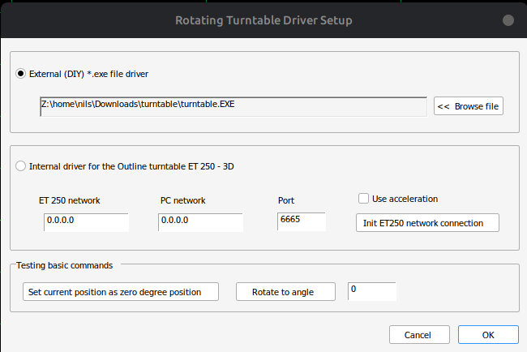

# ARTA einrichten

ARTA kann externe Drehtellerprogramme verwenden. Dieses Projekt nutzt dafür die Datei:

```text
ARTA Turntable File/turntable.exe
```

## Einrichtung

1. ARTA starten.
2. Menü öffnen:

```text
Setup -> Rotating turntable
```

3. `External` auswählen.
4. Als Programm `turntable.exe` aus dem Ordner `ARTA Turntable File/` eintragen.
5. Falls ARTA die Datei nicht direkt auswählbar macht, den Pfad manuell eintragen.



## Gruppenmessung starten

1. Menü öffnen:

```text
Record -> Spatial impulse response group record
```

2. Turntable Driver auswählen.
3. Messordner auswählen oder neu erstellen.
4. Winkelauflösung einstellen, z. B. `15°`.
5. Endwinkel einstellen, z. B. `45°`, `90°` oder `180°`.
6. Pause eintragen, z. B. `3 s`.
7. Dateiname prüfen.
8. Start drücken.


## Netzwerk

Der Arduino erhält seine IP-Adresse per DHCP und zeigt sie auf dem LCD an.

Im Sketch ist der UDP-Port festgelegt:

```cpp
unsigned int localPort = 10049;
```

Wenn keine Kommunikation stattfindet:

- IP-Adresse auf dem Display prüfen,
- Windows-Firewall prüfen,
- Netzwerkverbindung prüfen,
- sicherstellen, dass PC und Arduino im gleichen Netzwerk sind.

## Hinweis zur EXE

Aktuell liegt im Repository die fertige Windows-Datei `turntable.exe`. Für bessere Nachvollziehbarkeit sollte zusätzlich der Python- oder Quellcode dieser EXE veröffentlicht werden.
