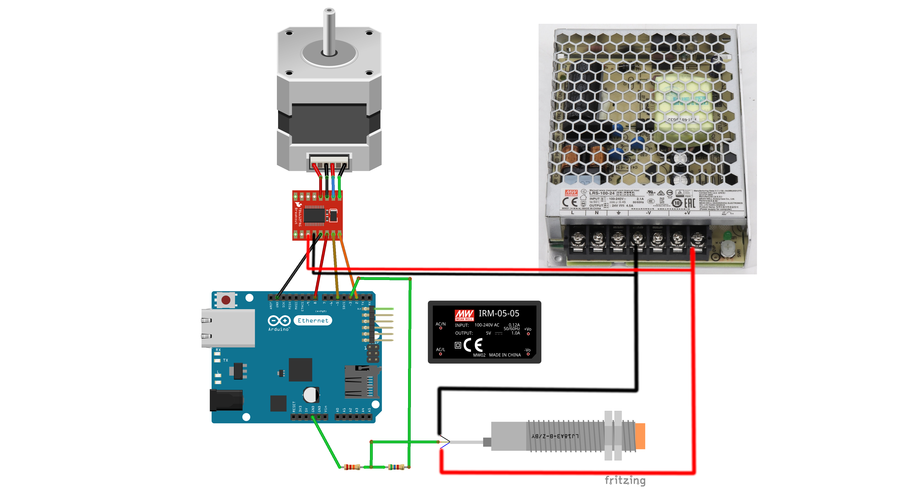

# Verdrahtung und Anschluss

Der Anschlussplan liegt hier:



## Arduino-Pins

| Funktion | Arduino-Pin | Beschreibung |
|---|---:|---|
| STEP / PULSE | D2 | Schrittimpuls zum TB6600 |
| Referenzsensor | D3 | Eingang für Referenzpunkt, im Code `INPUT_PULLUP` |
| DIRECTION | D5 | Richtungssignal zum TB6600 |
| ENABLE | D8 | Enable-Pin, im Code definiert |
| LCD | I2C SDA/SCL | 20x4 I2C-Display |
| Ethernet | Shield / integriert | Netzwerkverbindung zu ARTA-PC |

## Motortreiber TB6600

Typische Zuordnung:

| TB6600 | Verbindung |
|---|---|
| PUL / STEP | Arduino D2 |
| DIR | Arduino D5 |
| ENA | Arduino D8, falls genutzt |
| Motor A+/A-/B+/B- | Schrittmotorwicklungen |
| VCC/GND Motor | 24-V-Netzteil |

Die genaue Beschriftung kann je nach TB6600-Modul abweichen.

## Netzteile

| Spannung | Zweck |
|---:|---|
| 24 V | Versorgung Motortreiber / Schrittmotor |
| 5 V | Arduino, Display und Logik, je nach Aufbau |

## Referenzsensor

Der Referenzsensor wird im Sketch an Pin D3 verwendet:

```cpp
#define Referenzpunkt 3
pinMode(Referenzpunkt, INPUT_PULLUP);
```

Der Code erwartet einen HIGH/LOW-Wechsel während der Referenzfahrt. Wenn die Referenzfahrt in die falsche Richtung läuft oder nicht endet, Sensorlogik und Verdrahtung prüfen.

## Wichtige Hinweise

- GND-Bezüge sauber planen.
- 24 V und 5 V nicht verwechseln.
- TB6600-Strom passend zum Motor einstellen.
- Microstepping notieren, weil es `Stepsprograd` beeinflusst.
- Vor dem ersten Test Motor ohne Last prüfen.

## Sicherheit

**Netzspannung ist gefährlich. Arbeiten an 230 V dürfen nur von fachkundigen Personen durchgeführt werden.**

Vor dem Einschalten kontrollieren:

- keine losen Litzen,
- Zugentlastung vorhanden,
- Netzteile berührungssicher verbaut,
- richtige Polarität,
- Not-Aus oder einfache Abschaltmöglichkeit.
